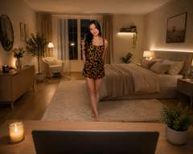

# v80 Celine Room — Canonical Visual Target Reference

This document locks the user-approved visual target for the remaining v80 room-polish work. Live GitHub remains source of truth for runtime state; this document is the visual acceptance contract.

## Canonical reference image

Repository path: `docs/celine/room-source/v80-2026-08-28/reference/CELINE_ROOM_VISUAL_TARGET.jpg`

This repository image is the canonical worker-visible visual reference for composition and atmosphere. It is a web-sized rendition of the exact user-supplied reference scene; it must not be replaced by a generated approximation or a generic bedroom reference. The original user-supplied source remains the authoritative high-resolution source.

## Core intent

The room must feel like a real, inhabited, stylish bedroom captured from a believable video-chat camera position — not a generic 3D/avatar background.

The target is cinematic realism through composition, depth, material response, local practical lighting, natural shadow falloff and restrained imperfection. Do not flatten the room by globally brightening everything.

## Composition contract

- Viewer/camera is positioned behind or immediately at a foreground table.
- The table is intentionally cropped by the bottom frame: only the near foreground/table surface or edge enters the image; it must not read as a fully displayed furniture object.
- This foreground occlusion is important: it establishes the viewer's physical position and creates a foreground -> Celine -> furniture -> back-wall depth stack.
- Celine occupies the central/mid-ground presence and must look physically embedded in the same room, not composited in front of it.
- Bed is a major right-side visual mass.
- Window/back-room opening contributes strong depth behind/near Celine.
- Dresser/mirror and secondary furniture/decor establish asymmetric lived-in detail rather than a sterile symmetrical set.
- Preserve plausible scale, contact and perspective.

## Lighting contract

- Warm evening/night-bedroom mood, approximately warm-white practical-light character rather than neutral studio illumination.
- Use localized pools of light and natural falloff; darker corners are desirable when plausible.
- Ceiling may naturally be somewhat darker than directly lit walls. Acceptance does NOT require identical wall/ceiling luminance.
- What is forbidden is the current artificial-looking grey/taupe ceiling separation or a flat globally illuminated shell.
- Practical/local lights should appear to belong to visible fixtures and surfaces.
- Avoid cold/white global fill, blown-out walls and game-like uniform lighting.

## Material/color contract

- Walls: warm, light beige/cream; not grey and not orange.
- Ceiling: warm neutral/beige response coherent with walls while retaining believable shading.
- Floor: natural warm wood; brown/honey character, not saturated orange/red-brown.
- Fabrics/furniture should retain texture and tonal separation under warm light rather than collapsing into one brown/orange grade.
- Surfaces should respond differently according to material; realism is more important than forcing one global color.

## Realism contract

Visual PASS requires the room to read as one physical space:
- Celine, floor, furniture and walls share coherent lighting and perspective.
- Foreground, mid-ground and background remain visibly layered.
- Shadows and light gradients are allowed and expected.
- Do not optimize toward a generic 'clean 3D bedroom' look.
- Do not remove depth cues merely to make proof screenshots brighter.
- Do not judge success from workflow SUCCESS alone; inspect actual HOME/CALL/HOME evidence against this target.

## Protected runtime constraints

This visual target does not authorize reopening accepted/protected behavior. Canonical Celine, accepted camera/zoom behavior, anchors/navigation/actions, Lamp behavior, room GLB bytes/geometry/transforms and the 12 immutable original furniture GLBs remain protected unless a later explicit evidence-backed work order authorizes a bounded change.

## Iteration rule

For each bounded visual candidate:
1. diagnose the largest remaining mismatch against this target;
2. change only the confirmed cause permitted by the active work order;
3. run the smallest required build;
4. run one targeted HOME -> CALL -> HOME proof when needed;
5. inspect the real images against this contract;
6. record explicit PASS/FAIL and the exact next action.

The final room-polish acceptance is not 'technically valid' or 'brighter'. It is: believable, warm, dimensional, stylish and recognizably aligned with Yahya's supplied reference composition and atmosphere.
